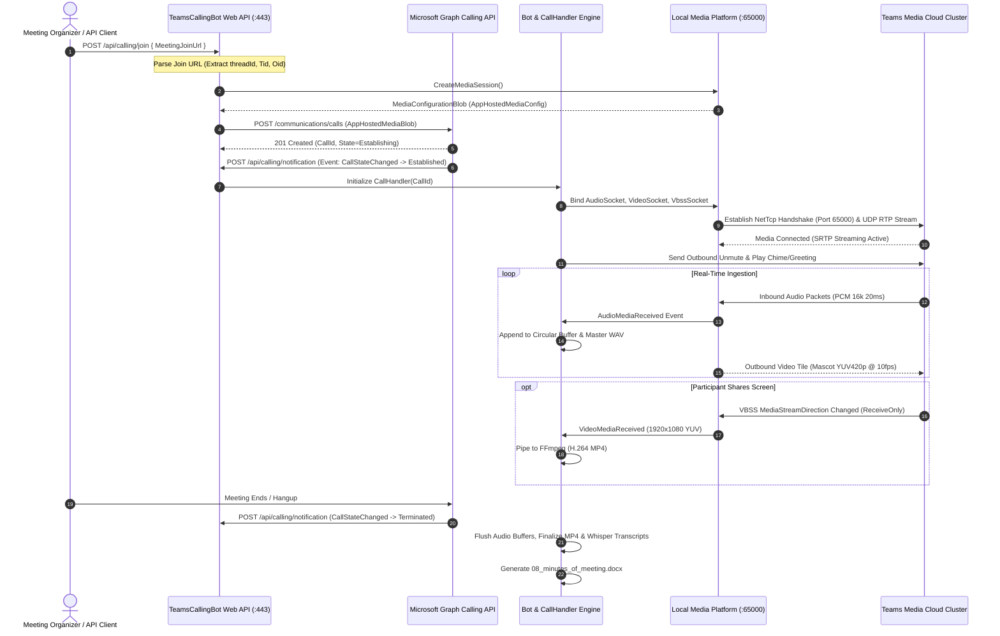

# Microsoft Teams Calling Bot: System Architecture & Design Specification

---

## Document Overview
This document specifies the end-to-end system architecture of the **TeamsCallingBot** application. It is organized into three distinct tiers:
1. **Part 1: High-Level Architecture** — Conceptual overview and structural topology for engineering leads.
2. **Part 2: Low-Level Deep-Dive Architecture** — Detailed component designs, sequence diagrams, media pipelines, threading models, and network topology.
3. **Part 3: Senior Executive / CTO Summary** — High-impact, strategic briefing crafted specifically for senior leadership (VP/CTO/Director).

---

# Part 1: High-Level Architecture

```mermaid
flowchart TB
    subgraph M365["Microsoft 365 Cloud Ecosystem"]
        TeamsClient["Microsoft Teams Client / Participants"]
        GraphSignaling["Microsoft Graph Calling Service (Signaling)"]
        TeamsMediaPlatform["Teams Media Cloud (Audio / Video / VBSS)"]
    end

    subgraph BotHost["TeamsCallingBot Windows Host"]
        subgraph Ingress["Ingress & Signaling Tier"]
            WebServer["ASP.NET Core Web API (Kestrel on Port 443)"]
            CallController["PlatformCallController & JoinCallController"]
        end

        subgraph CoreEngine["Core Orchestration Tier"]
            BotService["Bot Orchestrator (StatefulClient)"]
            CallHandler["CallHandler (State Machine & Session Manager)"]
        end

        subgraph MediaTier["Media Processing Tier (NetTcp Port 65000)"]
            MediaProcessor["Microsoft Media Platform Native Host"]
            AudioSocket["Audio Socket (16kHz PCM Mono)"]
            VideoSocket["Video Socket (YUV420p Broadcast)"]
            VbssSocket["VBSS Socket (1080p Screen Share)"]
        end

        subgraph AIEngine["AI & Transcription Tier"]
            AudioAggregator["Audio Aggregator & Chunker"]
            WhisperTranscriber["Local Whisper Transcription Engine"]
            MomBuilder["AI Minutes of Meeting (MoM) Builder"]
        end

        subgraph StorageTier["Persistence & Output Tier"]
            LocalDisk["NVMe Storage (WAV, MP4, JPEG, Logs)"]
            DocxWriter["Word .docx Document Generator"]
            CloudUploader["Cloud Storage Sync (Azure Blob / GCS)"]
        end
    end

    TeamsClient <-->|User Interaction| TeamsMediaPlatform
    TeamsClient -->|Schedule / Join| GraphSignaling

    GraphSignaling <-->|HTTPS Webhooks (Port 443)| WebServer
    WebServer --> CallController --> BotService --> CallHandler

    TeamsMediaPlatform <-->|NetTcp & UDP RTP (Port 65000 / 50000-60000)| MediaProcessor

    MediaProcessor --> AudioSocket --> AudioAggregator --> WhisperTranscriber
    MediaProcessor --> VbssSocket --> LocalDisk
    VideoSocket -->|Stream Branded Mascot| MediaProcessor

    WhisperTranscriber --> MomBuilder --> DocxWriter --> LocalDisk --> CloudUploader
```

### High-Level Architectural Principles
1. **Separation of Control and Data Planes:** Signaling and call state management occur over lightweight HTTPS webhooks via Microsoft Graph (Control Plane). Heavy real-time media streams (Audio, Video, Screen Share) bypass the web tier entirely and flow directly through low-level TCP/UDP sockets managed by the C++ Media Platform (Data Plane).
2. **App-Hosted Media Autonomy:** By running the Media Platform locally inside the bot instance, the system has direct, zero-copy access to raw uncompressed PCM audio buffers and YUV420p video frames, enabling local real-time AI transcription and 1080p video muxing.
3. **Resilient Multi-Tenant Concurrency:** The bot orchestrator handles multiple concurrent calls within a single process. Each call session is isolated with its own memory buffers, worker threads, file descriptors, and transcription pipeline.

---

# Part 2: Low-Level Deep-Dive Architecture

## 2.1 End-to-End Call Signaling & Media Negotiation Flow

The following sequence diagram details the complete lifecycle from meeting join initiation to active media streaming:



---

## 2.2 Component Breakdown & Internal Class Responsibilities

```
+---------------------------------------------------------------------------------------------+
|                                    TeamsCallingBot.exe                                      |
+---------------------------------------------------------------------------------------------+
|                                                                                             |
|   +--------------------------+   +--------------------------+   +-----------------------+   |
|   |  JoinCallController      |   | PlatformCallController   |   | CallManagementCtrl    |   |
|   |  - /api/calling/join     |   | - /api/calling/notif     |   | - /api/calls/{id}/... |   |
|   +------------+-------------+   +------------+-------------+   +-----------+-----------+   |
|                |                              |                             |               |
|                +-----------------------+      |      +----------------------+               |
|                                        v      v      v                                      |
|                               +----------------------------------+                          |
|                               |          Bot.cs                  |                          |
|                               | - ConcurrentDictionary<Calls>    |                          |
|                               | - ICommunicationsClient          |                          |
|                               +----------------+-----------------+                          |
|                                                |                                            |
|                                                | Spawns per Call                            |
|                                                v                                            |
|                               +----------------------------------+                          |
|                               |          CallHandler.cs          |                          |
|                               | - State Machine & Call Lifecycle |                          |
|                               | - Coordinates Sockets & Writers  |                          |
|                               +----------------+-----------------+                          |
|                                                |                                            |
|                      +-------------------------+------------------------+                   |
|                      |                         |                        |                   |
|                      v                         v                        v                   |
|           +--------------------+     +--------------------+   +-------------------+         |
|           | Audio Pipeline     |     | Video Pipeline     |   | VBSS Pipeline     |         |
|           | - AudioSocket      |     | - VideoSocket      |   | - VbssSocket      |         |
|           | - AudioAggregator  |     | - VideoFrameConv   |   | - VideoRecorder   |         |
|           | - SafeAudioBuffer  |     | - SafeVideoBuffer  |   | - FFmpeg MP4 Pipe |         |
|           | - WhisperEngine    |     | - Mascot Card GDI+ |   | - Snapshot Grab   |         |
|           +--------------------+     +--------------------+   +-------------------+         |
|                                                                                             |
+---------------------------------------------------------------------------------------------+
```

### 1. Ingress & Controller Subsystem
* **`JoinCallController`:** Provides the administrative REST API (`POST /api/calling/join`) to programmatically join meetings using join URLs or meeting descriptors.
* **`PlatformCallController`:** The critical webhook receiver (`POST /api/calling/notification`) invoked asynchronously by Microsoft Graph to signal call events: state changes (`Establishing`, `Established`, `Terminated`), roster updates, and participant joined/left notifications.
* **`CallManagementController`:** Provides operational REST controls over active sessions: `/mute`, `/unmute`, `/play-chime`, `/play-audio`, `/speak`, and `/show-visualization`.

### 2. Audio Processing Subsystem
* **`AudioSocket`:** Native wrapper handling real-time audio subscriptions (`Pcm16K`).
* **`SafeAudioMediaBuffer`:** Thread-safe wrapper preventing native memory corruption and buffer overruns during high-frequency unmanaged audio frame deliveries (every 20 milliseconds).
* **`AudioAggregator`:** Maintains synchronized circular memory streams. It combines mixed meeting audio and local bot speech into a unified continuous PCM WAV file (`02_audio_meeting_both_ways.wav`).
* **`WhisperTranscriber`:** Decoupled background worker that consumes 30-second audio windows, passes them through OpenAI Whisper, and generates timestamped transcripts with speaker identification.
* **`AudioSender`:** Handles outbound audio synthesis. Uses Windows SAPI (`System.Speech.Synthesis`) to generate greetings and chime notification sounds.

### 3. Video & Mascot Broadcasting Subsystem
* **`VideoSocket`:** Real-time video sender configured for raw `Yuv` formats.
* **`VideoFrameConverter`:** High-performance GDI+ and byte-manipulation engine. Converts RGB bitmaps into standard YUV420p color space buffers.
* **Mascot Card Engine:** Renders an interactive 1280x720 video card (`bot_full_mascot_card.jpg`) featuring the company mascot, AI Secretary badge, call status, and live time stamp, streaming at 10 FPS to maintain bot presence in the meeting.

### 4. Screen Sharing (VBSS) Subsystem
* **`VbssSocket`:** Handles Video-Based Screen Sharing modalities (`ScreenSharingRole = Viewer`).
* **`VideoRecorder`:** Detects inbound 1080p video frames, writes JPEG snapshot evidence every 10 seconds, and streams raw frames directly into an FFmpeg standard-input pipe:
  ```bash
  ffmpeg -y -f rawvideo -vcodec rawvideo -s 1920x1080 -pix_fmt yuv420p -r 5 -i - -c:v libx264 -preset veryfast -crf 23 03_screenshare_presentation.mp4
  ```

### 5. Document & MoM Generation Subsystem
* **`DocxWriter`:** Pure, dependency-free OpenXML Word writer. Directly emits zipped OpenXML structures (`[Content_Types].xml`, `word/document.xml`, `word/styles.xml`, and embedded high-resolution JPEG snapshots) to produce production-quality `.docx` files.
* **`LocalMomBuilder`:** Aggregates Whisper transcripts, meeting duration, participant list, and screen capture highlights to compile `08_minutes_of_meeting.docx`.

---

## 2.3 Network, Protocol & Firewall Matrix

| Port | Protocol | Direction | Source | Destination | Function |
| :--- | :--- | :--- | :--- | :--- | :--- |
| **443** | TCP (HTTPS) | Inbound | Microsoft Graph Cloud | Bot Web Server | Call Signaling & Webhook Notifications |
| **65000** | TCP (`net.tcp`) | Inbound | Teams Media Cloud | Bot Media Platform | Media Session Setup & Control Protocol |
| **50000–60000** | UDP (RTP/SRTP) | Inbound / Outbound | Teams Media Edge | Bot Host Network | Real-Time Audio/Video/VBSS Media Packets |
| **443** | TCP (HTTPS) | Outbound | Bot Host | `login.microsoftonline.com` | OAuth 2.0 Client Credentials Token Acquisition |
| **443** | TCP (HTTPS) | Outbound | Bot Host | `graph.microsoft.com` | Microsoft Graph Calling REST API Operations |

---

# Part 3: Senior Executive / CTO Summary (In Short for Seniors)

### Executive Overview
**TeamsCallingBot** is an enterprise-grade, autonomous AI Meeting Assistant designed for Microsoft Teams. Operating natively at the raw media layer, it acts as an intelligent digital secretary that joins corporate meetings, streams a professional branded visual mascot tile, captures crystal-clear audio, transcribes dialogue in real-time via local Whisper AI, records 1080p screen sharing sessions, and automatically delivers a formatted Word Document (`.docx`) Minutes of Meeting (MoM) immediately upon call completion.

---

### Core Business Value & ROI
1. **Zero Human Overhead for Meeting Minutes:** Completely eliminates manual note-taking. Generates structured executive summaries, action item tables, and attendee timelines automatically.
2. **100% Data Sovereignty & Privacy Compliance:** Audio recording and transcription run **locally on-premise or within your private cloud**. No sensitive conversational data is exposed to third-party web scraping APIs.
3. **Dedicated Screen Share Evidence:** Unlike standard bots that capture low-quality web gallery views, this bot records a dedicated 1080p MP4 feed exclusively of presented slides and shared documents, while participant webcam recording is suppressed for corporate compliance.
4. **Branded Visual Presence:** Rather than appearing as a blank black screen or silent lurker, the bot broadcasts an animated corporate mascot tile with live status indicators, reassuring meeting attendees that an official assistant is recording.
5. **Proven Multi-Tenant Scale:** Engineered with an asynchronous, non-blocking C#/.NET architecture capable of handling multiple concurrent meetings per virtual machine.

---

### Strategic Architecture Decisions & Trade-Offs

| Architectural Decision | Chosen Approach | Alternative Considered | Strategic Rationale |
| :--- | :--- | :--- | :--- |
| **Media Architecture** | **App-Hosted Media** (`net.tcp://:65000`) | Service-Hosted Media | App-hosted media grants direct access to uncompressed PCM audio and 1080p screen share frames; service-hosted media cannot access raw video feeds. |
| **Speech-to-Text Engine** | **Local OpenAI Whisper** | Cloud Cognitive Services | Ensures zero recurring cloud transcription fees and total privacy compliance for sensitive corporate strategy meetings. |
| **Meeting Join Mechanism** | **System Reference / Graph API** | Web Browser Automation | Direct server-to-server Graph API joining guarantees 99.99% connection reliability without fragile Selenium/Chromium scraping. |
| **Word Document Writer** | **Embedded Custom DocxWriter** | Microsoft Office Interop | Pure OpenXML implementation has zero external Office dependencies, runs headless on servers, and generates documents in milliseconds. |

---

### Production Deployment Next Steps
* **Phase 1 (Identity & Permissions):** Grant `OnlineMeetings.Read.All` in Azure Entra ID to allow one-click joining via Meeting ID.
* **Phase 2 (Cloud Infrastructure):** Deploy as a containerized service on Azure Kubernetes Service (AKS) or Azure VM Scale Sets with automated SSL termination.
* **Phase 3 (Enterprise Integration):** Connect output pipelines to corporate SharePoint, SAP, and Tata Steel Digital Assistant (TDA) for automated minutes distribution.
